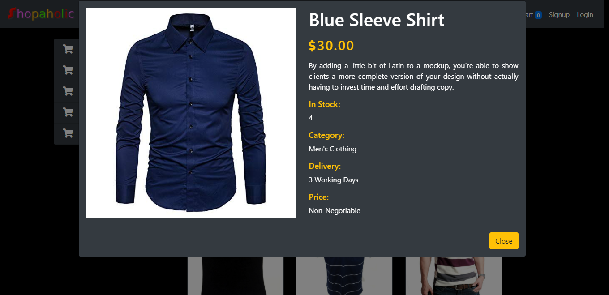

### A full responsive e-shop application using Django framework and Bootstrap4.

#### Customer can signup, login, add product to the cart without being logged in, checkout and see their order along with their order status. Custom validation has been added for bothlogin and signup. Similarly, admin can add categories wise products, view registered customers and their orders.

# Getting Started
Username: testuser

Password: crack321

# Demo

### Home Page

### View by Category

### Product View

### Login Page

### Signup Page

### Cart Page

### Order Page after checkout

### Checkout Form

### Admin Dashboard

### Product view in Admin

### Customer view in Admin

